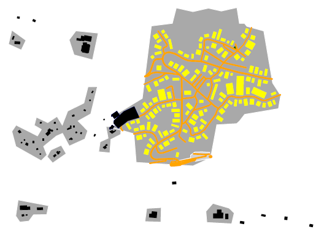

.. _chapter-howitworks-label:

##################
How osm2city Works
##################

``osm2city`` is a set of procedural programs, which together create plausible FlightGear scenery objects (buildings, roads, power lines, piers, platforms etc.) based on OpenStreetMap_ (OSM) data as well as data already existing in the default FlightGear `World Scenery`_.

``Plausible`` means here that the generated scenery should look in a way that a person not knowing the details of a specific location could believe that reality actually looks like that. Or that a person knowing the location would find a fair representation of landmarks and dimensions to find her / his way around in the virtual world.

This plausible world is achieved tried to be achieved by using `heuristics`_ to interpret the data input and combine it with a set of :ref:`parameters <chapter-parameters-label>` as well as some randomness.

FlightGear and its World Scenery represent almost any location in our world. ``osm2city`` attempts to support this. Instead of a set of artists and programmers developing a specific scenery in a confined part of the world, which often means putting a considerable amount of hand-made objects into the scenery and tweaking stuff manually, ``osm2city`` uses generic heuristics, models, textures etc. and applies them to any part of the world with some parametrisation. This makes the task to cover the world a bit easier, but of course can only mimic the real world so much.

And then there are two twists to what is stated in the previous paragraph:

* The scenery generated by ``osm2city`` respects the static objects put into the default scenery by diverse FlightGear scenery developers around the world — especially airports and landmarks like bridges, worship buildings etc. (see also the `FlightGear Scenery Website`_ and the `Map over Scenery Models`_). I.e. the better the specific location is covered by manually created and placed static object, the closer to reality the combination with ``osm2city`` generated scenery objects might get.
* ``osm2city`` generated scenery is only as good as the underlying data. The higher the density and quality of the mapping done in OpenStreetMap, the better the scenery gets. In many parts of the world only a minor share of buildings is mapped at all. Often the only information available are floor plans and generic land-use zones — although the available `map features`_ in OSM are abundant and would allow for extreme sophistication (to be fair: this would then again require quite some sophistication in ``osm2city`` to consume). In some cities (especially Europe) mappers are using `Simple 3D Buildings`_, which results in nice representations in ``osm2city``, which can come close to hand-crafted models.

Remember: FlightGears default scenery is only using freely available (world-wide) data and related freely available scenery objects. And so is ``osm2city``. This data is often not as detailed as commercial products can provide.

==============
Specific Stuff
==============

Many features are explained in the :ref:`parameters <chapter-parameters-label>` section. The subchapters below give some additional details.

--------------------------------
Elevation and Detection of Water
--------------------------------

``osm2city`` generated scenery must play nicely with the default FlightGear scenery. This principle is also true if ``osm2city`` has access to better data in e.g. OSM.

Height above sea level is taken from the FlightGear scenery through some built in functionality in FlightGear (``fgelev``).

The FlightGear scenery is also used to determine, where there is water (the land-use information in FlightGear does sometimes deviate considerably from OSM — up to tens of meters). If ``PROBE_FOR_WATER`` is set to True, then buildings and roads are as far as possible not placed into water.

.. _chapter-howto-land-use-label:

-----------------
Land-use Handling
-----------------

Land-use processing is a bit intricate, because OSM data is often insufficient or even lacking. Also for building heuristics it is necessary to have some idea about whether a built-up area is close to a centre and/or the type of area (e.g. village vs. town).

To understand the following it is important to first read chapter about :ref:`Land-use <chapter-parameters-landuse-label>` parameters.

Once the land-use zone for built-up areas are read from OSM and/or generated (called "building_zones" in the code), lit areas are created by buffering all building zones and then merging as far as possible. These lit areas are not only used to determine, which streets should be lit, but are also used as a settlement clusters for cities and towns.

Only settlement areas tagged in OSM with ``place=city`` or ``place=town`` are considered for further processing of built-up areas, where apartments etc. exist. This is because the rural types are used as default, ``place=farm`` is treated specially and values for ``place`` like ``quarter``, ``suburb``, ``neighbourhood`` do not provide extra information. For ``city`` and ``town`` feature types Node, Way and Relation are read from OSM, however Way and Relation are reduced to a node by using the area's centroid. Note that a pre-requisite for this to work is that the mapping in OSM has been done as instructed in `Key Place`_.

In a first step all city or town places are linked to lit areas. Then the zones are split into city_block objects, i.e. areas surrounded by streets — some of the polygons will be real city blocks, others will be border areas (the "city" part is not really true here - even a hamlet could in osm2city get divided into several city_blocks). The city blocks take over the land-use type (type can be ``non-osm`` if generated and therefore without real meaning).

Finally depending on the place type and the distance to the centroid a given city block has, it is assigned one of the following settlement types:

* ``centre``: the centre of a city (not available for towns). Max distance = population^(1/2)
* ``block``: an area in the center of a city, where streets define blocks, and the buildings within the blocks most often are apartment like buildings, where the facades are aligned with the street and most often buildings are connected. Max distance = population^(5/8).
* ``dense``: an area with dense population mostly living in apartments, but the apartment houses are not necessarily connected. Max distance = population^(2/3).
* ``periphery``: an area with mostly (detached) houses. Outside of max distance for ``dense``.

Please be aware that there is no "science" behind the chosen concentric ring radii and the settlement types. It is just a heuristic / an observation that the farther away from the city centre you get, the less dense the area. Also the settlement area is "some" function of the population (and the commuting workers into a city/town from outside are neglected). Also in some areas of the world densities are higher. This can be corrected with a linear parameter. The population is taken as is from OSM - if missing a parametrised default population is used.

The following table shows the resulting radii in metres for some example population sizes:

=====    ==========    ======    =====    ======
Place    Population    Centre    Block    Dense
=====    ==========    ======    =====    ======
Town     10 000        n/a       316      464
Town     50 000        n/a       864      1357
City     100 000       316       1334     2154
City     200 000       447       2056     3419
City     1 000 000     1000      5623     10000
=====    ==========    ======    =====    ======

I.e. all city blocks linked to building zones are tested against these circles and if intersecting/within, then the most "centric" one is linked to the city block.

.. _chapter-howto-generate-would-be-buildings-label:

---------------------------
Generate Would-Be Buildings
---------------------------
This is the core operation of the OWBB library. It generates buildings at probable places based on land-use zones, existing buildings and a set of parameters. At the core of the algorithm all streets within land-use zones are followed and to the left and right spots are searched for, where there would be place for an additional building — the building type being a function of the land-use zone, other buildings, street type and a set of parameters.

As an example the following picture shows generated buildings (yellow) based on land-use zones as defined in the previous chapter.

.. _OpenStreetMap: https://www.openstreetmap.org/
.. _World Scenery: http://wiki.flightgear.org/World_Scenery
.. _heuristics: https://en.wikipedia.org/wiki/Heuristic
.. _FlightGear Scenery Website: https://scenery.flightgear.org/
.. _Map over Scenery Models: https://scenery.flightgear.org/map/
.. _map features: https://wiki.openstreetmap.org/wiki/Map_Features
.. _Simple 3D Buildings: https://wiki.openstreetmap.org/wiki/Simple_3D_buildings
.. _Place: https://wiki.openstreetmap.org/wiki/Places
.. _Key Place: https://wiki.openstreetmap.org/wiki/Key:place
