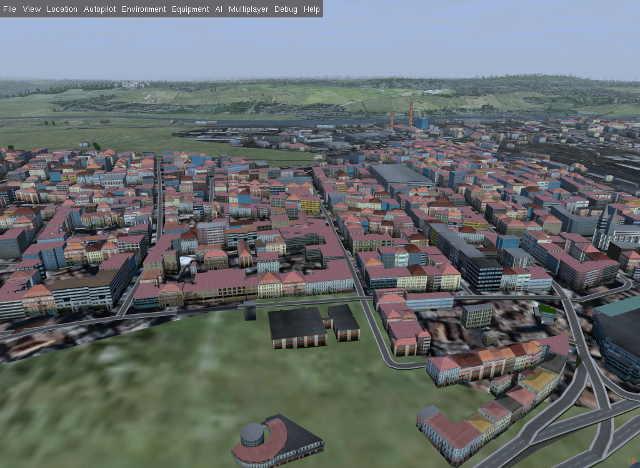
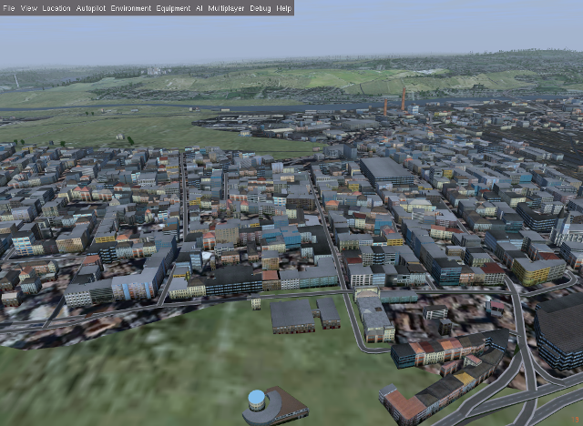
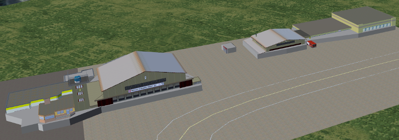
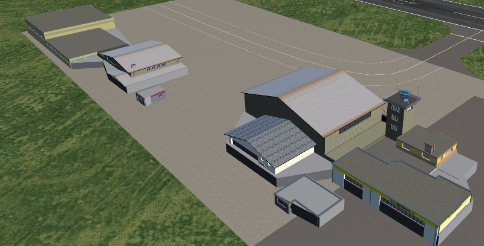
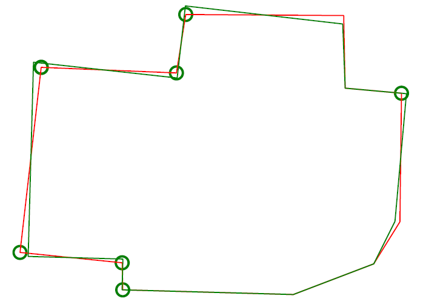
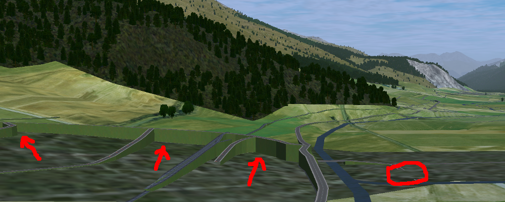
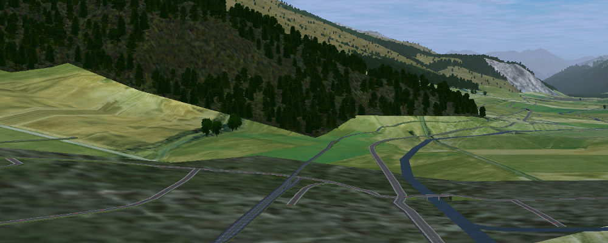
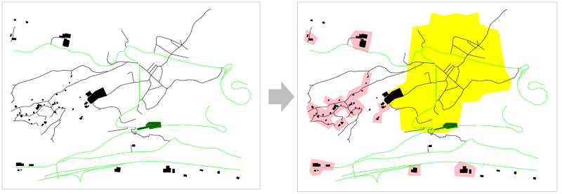

.. _chapter-parameters-label:

####################
Parameters [Builder]
####################

Please consider the following:

* Python does not recognize operating system environment variables, please use full paths in the parameters file (no ``$HOME`` etc).
* These parameters determine how scenery objects are generated offline as described in chapter :ref:`Scenery Generation <chapter-generation-label>`.
* All decimals need to be with "." — i.e. local specific decimal separators like "," are not accepted.
* Unless specified otherwise then all length is in metres and areas are in square metres.
* You do not have to specify all parameters in your ``params.ini`` file. Actually it is better only to specify those parameters, which you want to actively control — the rest just gets the defaults.

=========================
View a List of Parameters
=========================

The final truth about parameters is stored in ``parameters.py`` — unfortunately the content in this chapter of the manual might be out of date (including default values).

It might be easiest to read ``parameters.py`` directly. Python code is easy to read also for non-programmers. Otherwise you can run the following to see a listing:

::

    /usr/bin/python3 /home/vanosten/develop_vcs/osm2city/parameters.py -d

If you want to see a listing of the actual parameters used during scenery generation (i.e. a combination of the defaults with the overridden values in your ``params.ini`` file, then you can run the following command:

::

    /usr/bin/python3 --file /home/pingu/development/osm2city/parameters.py -f LSZS/params.ini

====================
Important Parameters
====================

.. _chapter-param-minimal-label:

-----------
Minimal Set
-----------

See also :ref:`Setting a Minimal Set of Parameters <chapter-setting-parameters-label>`.

=============================================   ========   =======   ==============================================================================
Parameter                                       Type       Default   Description / Example
=============================================   ========   =======   ==============================================================================
PREFIX                                          String     n/a       Name of the scenery project. Do not use spaces in the name.

PATH_TO_SCENERY                                 Path       n/a       Full path to the scenery folder without trailing slash. This is where we will
                                                                     probe elevation and check for overlap with static objects. Most likely you'll
                                                                     want to use your TerraSync path here.

PATH_TO_SCENERY_OPT                             List       None      Optional additional paths to scenery folders (e.g. for `Project3000`_).
                                                                     Specified as a list of strings (e.g. ['/foo/uno', '/foo/due'].
                                                                     Only used for overlap checking for buildings against static and shared
                                                                     objects.

PATH_TO_OUTPUT                                  Path       n/a       The generated scenery (.stg, .ac, .xml) will be written to this path. If empty
                                                                     then the correct location in PATH_TO_SCENERY is used. Note that if you use
                                                                     TerraSync for PATH_TO_SCENERY, you MUST choose a different path here. 
                                                                     Otherwise, TerraSync will overwrite the generated scenery. Unless you know 
                                                                     what you are doing, there is no reason not to specify a dedicated path here.
                                                                     While not absolutely needed it is good practice to name the output folder 
                                                                     the same as ``PREFIX``.

PATH_TO_OSM2CITY_DATA                           Path       n/a       Full path to the folder with osm2city-data. See chapter
                                                                     :ref:`Installation of osm2city <chapter-osm2city-install>` (e.g.
                                                                     "/home/user/osm2city-data").

FG_ELEV                                         String     n/a       Points to the full path of the fgelev executable. On Linux it could be
                                                                     something like ``.../bin/fgfs_git/next/install/flightgear/bin/fgelev'``.
                                                                     On Windows you might have to put quotes around the path due to whitespace
                                                                     e.g. ``'"D:/Program Files/FlightGear/bin/Win64/fgelev.exe"'``.

PROBE_FOR_WATER                                 Boolean    False     Checks the scenery in ``PATH_TO_SCENERY`` whether points are in the water or
                                                                     not. The FlightGear scenery's water boundaries might be different from OSM.
                                                                     E.g. removes buildings if at least one corner is in the water. And removes
                                                                     or splits (parts of) roads/railways, if at least 1 point is in the water.
                                                                     Only possible with FGElev version after 9th of November 2016 / FG 2016.4.1.

=============================================   ========   =======   ==============================================================================

.. _`Project3000`: http://wiki.flightgear.org/Project3000

.. _chapter-param-flags-label:

---------------
Important Flags
---------------

=============================================   ========   =======   ==============================================================================
Parameter                                       Type       Default   Description / Example
=============================================   ========   =======   ==============================================================================
FLAG_2018_3                                     Boolean    False     If True then then the texture catalog and shader integration is for minimal
                                                                     version of FlightGear 2018.3.

BUILDING_USE_SHARED_WORSHIP                     Boolean    False     Use a shared model for worship buildings instead of OSM floor plan and
                                                                     heuristics. The shared models will try to respect the type of building (e.g.
                                                                     church vs. mosque) and will in size (not height) respect the convex hull of
                                                                     the building floor plan in OSM.
                                                                     If the building is composed of several parts as in OSM 3D buildings, then no
                                                                     shared models are used - as it is assumed that the 3D modeling is more
                                                                     realistic (e.g number and height of towers) than a generic model, although
                                                                     the facade texture is more dumb than a typical shared model texture.

NO_ELEV                                         Boolean    False     The only reason to set this to ``True`` would be for scenery builders to
                                                                     check generated scenery objects a bit faster not caring about the vertical
                                                                     position in the scenery.

=============================================   ========   =======   ==============================================================================

=========
Buildings
=========

.. _chapter-parameters-lod-label:

-----------------------------
Level of Details of Buildings
-----------------------------

The more buildings you have in LOD detailed, the less resources for rendering are used. However you might find it "irritating" the more buildings suddenly appear. Experiment with the settings in FlightGear, see also :ref:`Adjusting Visibility of Scenery Objects <chapter-lod-label>`. 

=============================================   ========   =======   ==============================================================================
Parameter                                       Type       Default   Description / Example
=============================================   ========   =======   ==============================================================================
LOD_ALWAYS_DETAIL_BELOW_AREA                    Integer    150       Below this area, buildings will always be LOD detailed

LOD_ALWAYS_ROUGH_ABOVE_AREA                     Integer    500       Above this area, buildings will always be LOD rough

LOD_ALWAYS_ROUGH_ABOVE_LEVELS                   Integer    6         Above this number of levels, buildings will always be LOD rough

LOD_ALWAYS_DETAIL_BELOW_LEVELS                  Integer    3         Below this number of levels, buildings will always be LOD detailed

LOD_PERCENTAGE_DETAIL                           Decimal    0.5       Of the remaining buildings, this percentage will be LOD detailed,
                                                                     the rest will be LOD rough.

=============================================   ========   =======   ==============================================================================

--------------------------
Building Levels and Height
--------------------------

In OSM the height of a building can be described using the following keys:
* ``building:height``
* ``roof:height``
* ``height`` (the total of building_height and roof_height, but most often used alone)
* ``building:levels``
* ``roof:levels`` (not used in osm2city)
* ``levels``

Most often none of these features are tagged and then the number of levels are determined based on the settlement type and the corresponding ``BUILDING_NUMBER_LEVELS_* `` parameter. The height is always calculated as the product of the number of levels times parameter ``BUILDING_LEVEL_HEIGHT_*``. If only the height is given, then the levels are calculated by simple rounding — and this level value is then used for calculating the height. The reason for this is that some uniformity in building heights/values is normally observed in the real world — and because textures have a defined height per level.

An exception to this is made for building parts in a relationship (`Simple 3D buildings`_), as the heights in this case might be necessary to be correct (e.g. a dome on a church).

The distribution is using Python random triangular_, where low <= N <= high and the specified mode between those bounds.

.. _triangular: https://docs.python.org/3.5/library/random.html#random.triangular
.. _Simple 3D buildings: http://wiki.openstreetmap.org/wiki/Simple_3D_buildings

.. _chapter-parameters-buildings-european-label:

------------------------------------------
European Style Inner Cities (Experimental)
------------------------------------------

Given the available textures in ``osm2city-data`` and the limited tagging of buildings in OSM as of fall 2017, European cities look wrong, because there are too many modern facades used and too many flat roofs.

The following parameters try to "fix" this by adding OSM-tags ``roof:colour=red`` and ``roof:shape=gabled`` to all those buildings, which do not have parents or pseudo-parents (i.e. nor relationships or parts in OSM), but which share node references with other buildings. So typically what is happening in blocks in inner cities in Europe.

Excluded from this are buildings tagged as ``building=house`` or ``building=terrace`` or ``building=detached``.

=============================================   ========   =======   ==============================================================================
Parameter                                       Type       Default   Description / Example
=============================================   ========   =======   ==============================================================================
BUILDING_FORCE_EUROPEAN_INNER_CITY_STYLE        Boolean    False     If True then some OSM tags are enforced to better simulate European style
                                                                     buildings - especially in inner cities.

BUILDING_FORCE_EUROPEAN_MAX_LEVEL               Integer    5         If the buildings is tagged with more levels than this parameter or the
                                                                     corresponding height of levels * BUILDING_CITY_LEVEL_HEIGHT_HIGH, then the
                                                                     OSM tags are not enforced.

=============================================   ========   =======   ==============================================================================

Example of using the flag set to True in a part of Prague:

vs. setting it to False (default):

.. _chapter-parameters-roofs-label:

------------------
Roofs on Buildings
------------------

Below you will find quite a lot of parameters deciding what type of roofs should be generated on buildings. To understand the basic concepts, you should understand `OSM Simple 3D buildings`_. With ``complex roof`` below all those roof types, which are not flat/horizontal are meant.

The following parameters decide whether a complex roof should be used on top of a building at all.

=============================================   ========   =======   ==============================================================================
Parameter                                       Type       Default   Description / Example
=============================================   ========   =======   ==============================================================================
BUILDING_COMPLEX_ROOFS                          Bool       True      Set this to false if only flat roofs should be used. Good for performance, but
                                                                     not so nice for the eye.
                                                                     If this is set to False, all other parameters do not matter.

BUILDING_COMPLEX_ROOFS_MIN_LEVELS               Integer    1         Don't put complex roof on buildings smaller than the specified value unless
                                                                     there is an explicit ``roof:shape`` flag in OSM.

BUILDING_COMPLEX_ROOFS_MAX_LEVELS               Integer    5         Don't put complex roofs on buildings taller than the specified value unless
                                                                     there is an explicit ``roof:shape`` flag in OSM.

BUILDING_COMPLEX_ROOFS_MAX_AREA                 Integer    1600      Don't put complex roofs on buildings larger than this.

BUILDING_COMPLEX_ROOFS_MIN_RATIO_AREA           Integer    600       If a building is larger than this but smaller than ``..._MAX_AREA``, then
                                                                     it is compared whether the building tends to be small and long, because often
                                                                     one more square buildings, which at the same time are large, the roof tends
                                                                     to be flat.

BUILDING_SKEL_MAX_NODES                         Integer    10        The maximum number of nodes for which a complex roof is generated. The higher
                                                                     the number, the longer the execution time but the more houses actually get
                                                                     realistic roofs.

=============================================   ========   =======   ==============================================================================

If the ``roof:shape`` tag is missing in OSM (which it most often is), then the following parameters can help to make region specific decisions on what roof types are to be applied randomly with a given ratio. The sum of the ratios must give 1.0.

=============================================   ========   =======
Parameter                                       Type       Default
=============================================   ========   =======
BUILDING_ROOF_FLAT_RATIO                        Decimal    0.2
BUILDING_ROOF_SKILLION_RATIO                    Decimal    0.1
BUILDING_ROOF_GABLED_RATIO                      Decimal    0.55
BUILDING_ROOF_HIPPED_RATIO                      Decimal    0.1
BUILDING_ROOF_PYRAMIDAL_RATIO                   Decimal    0.05
=============================================   ========   =======

Finally the following parameters let you play around with how complex roofs are done.

=============================================   ========   =======   ==============================================================================
Parameter                                       Type       Default   Description / Example
=============================================   ========   =======   ==============================================================================
BUILDING_SKEL_ROOFS_MIN_ANGLE                   Integer    10        The minimum angle of the roof
BUILDING_SKEL_ROOFS_MAX_ANGLE                   Integer    50        The max angle of the roof. Some randomness is applied between MIN and MAX.
BUILDING_SKILLION_ROOF_MAX_HEIGHT               Decimal    2.        No matter the MIN and MAX angles: a skillion will have at most this height
                                                                     difference.
BUILDING_SKEL_ROOF_MAX_HEIGHT                   Decimal    6.        Skip skeleton roofs (gabled, pyramidal, ..) if the roof height is larger than
                                                                     this value.
BUILDING_SKEL_ROOF_DEFAULT_HEIGHT               Decimal    2.5       If the roof_height is not given in OSM this is what is used to calculate the
                                                                     real building height temporarily - until the real roof is constructed.
                                                                     Unless you know the code behind or see very odd effects, then you should
                                                                     probably not change this value.
=============================================   ========   =======   ==============================================================================

.. _`OSM Simple 3D buildings`: http://wiki.openstreetmap.org/wiki/Simple_3D_buildings

.. _chapter-parameters-overlap-label:

---------------------------
Overlap Check for Buildings
---------------------------

Overlap checks try to omit overlap of buildings generated based on OSM data with static object as well as shared objects (depending on parameter ``OVERLAP_CHECK_CONSIDER_SHARED``) in the default scenery (defined by ``PATH_TO_SCENERY``).

If parameter ``PATH_TO_SCENERY_OPT`` is not None, then also object from that path are considered (e.g. for Project3000).

=============================================   ========   =======   ==============================================================================
Parameter                                       Type       Default   Description / Example
=============================================   ========   =======   ==============================================================================
OVERLAP_CHECK_CONVEX_HULL                       Bool       True      Reads all points from static (not shared) objects and creates a convex hull
                                                                     around all points. This is a brute force algorithm only taking into account
                                                                     the firsts object's vertices.

OVERLAP_CHECK_CH_BUFFER_STATIC                  Decimal    0.0       Buffer around static objects to extend the overlap area. In general convex
                                                                     hull is already a conservative approach, so using 0 (zero) should be fine.

OVERLAP_CHECK_CH_BUFFER_SHARED                  Decimal    0.0       Same as above but for shared objects.

OVERLAP_CHECK_CONSIDER_SHARED                   Bool       True      Whether only static objects (i.e. a unique representation of a real world
                                                                     thing) should be taken into account — or also shared objects (i.e. generic
                                                                     models reused in different places like a church model).
                                                                     For this to work ``PATH_TO_SCENERY`` must point to the TerraSync directory.

OVERLAP_CHECK_BRIDGE_MIN_REMAINING              Integer    10        When a static bridge model intersect with a way, how much must at least be
                                                                     left so the way is kept after intersection.
=============================================   ========   =======   ==============================================================================

Examples of overlap objects based on static objects at LSZS (light grey structures at bottom of buildings):

-----------------
Rectify Buildings
-----------------
Rectifies angles of corners in buildings to 90 degrees as far as possible (configurable). This operation works on existing buildings as mapped in OSM. It corrects human errors during mapping, when angles are not straight 90 degrees (which they are in reality for the major part of corners). I.e. there is no new information added, only existing information corrected.

This operation is mainly used for eye-candy and to allow easier 3-D visualization. It can be left out if you feel that the OSM mappers have done a good job / used good tooling. On the other hand the processing time compared to other operations is negligible.

The following picture shows an example of a rectified building with a more complex layout. The results are more difficult to predict the more corners there are. The red line is the original boundary, the green line the rectified boundary. Green circles are at corners, where the corner's angle is different from 90 degrees but within a configurable deviation (typically between 5 and 10 degrees). Corners shared with other buildings are not changed by the rectify algorithm (not shown here).

Please note that if you are annoyed with angles in OSM, then you have to rectify them manually in OSM. One way to do that is to use :ref:`JOSM <chapter-josm-label>` and related plugins.

=============================================   ========   =======   ==============================================================================
Parameter                                       Type       Default   Description / Example
=============================================   ========   =======   ==============================================================================
RECTIFY_ENABLED                                 Boolean    True      Toggle whether the rectify operation should be used.

RECTIFY_90_TOLERANCE                            Number     0.1       Small tolerance from 90 degrees not leading to rectification of corner.

RECTIFY_MAX_90_DEVIATION                        Number     7         By how much an angle can be smaller or larger than 90 to still be rectified.
                                                                     You might need to experiment a bit and use plotting to determine a good value.

RECTIFY_MAX_DRAW_SAMPLE                         Number     20        How many randomly chosen buildings having rectified corners shall be plotted.
                                                                     The more buildings the better for comparison. However plotting can take quite
                                                                     some time and system resources.

RECTIFY_SEED_SAMPLE                             Boolean    True      If set to True then the randomizer uses a different seed each time.
                                                                     In some situations it might be better when the same set of random buildings
                                                                     are plotted each time - e.g. when experimenting with parameters and wanting to
                                                                     compare the outcomes.
=============================================   ========   =======   ==============================================================================

.. _chapter-parameters-light:

--------------------------
Light Effects on Buildings
--------------------------

Parameters for some light effects.

=============================================   ========   =======   ==============================================================================
Parameter                                       Type       Default   Description / Example
=============================================   ========   =======   ==============================================================================
OBSTRUCTION_LIGHT_MIN_LEVELS                    Integer    15        Puts red obstruction lights on buildings >= the specified number levels.
                                                                     If you do not want this, then just set the value to 0.

BUILDING_FAKE_AMBIENT_OCCLUSION                 Boolean    True      Fake ambient occlusion by darkening facade textures towards the ground, using
                                                                     the formula 1 - VALUE * exp(- AGL / HEIGHT ) during texture atlas generation.
BUILDING_FAKE_AMBIENT_OCCLUSION_HEIGHT          Number     6.        (see above)
BUILDING_FAKE_AMBIENT_OCCLUSION_VALUE           Number     0.6       (see above)

=============================================   ========   =======   ==============================================================================

.. _chapter-parameters-roads:

================================
Linear Objects (Roads, Railways)
================================

Parameters for roads, railways and related bridges. One of the challenges to show specific textures based on OSM data is to fit the texture such that it drapes ok on top of the scenery. Therefore several parameters relate to enabling proper draping.

=============================================   ========   =======   ==============================================================================
Parameter                                       Type       Default   Description / Example
=============================================   ========   =======   ==============================================================================
BRIDGE_MIN_LENGTH                               Decimal    20.       Discard short bridges and draw roads or railways instead.

MIN_ABOVE_GROUND_LEVEL                          Decimal    0.01      How much a highway / railway is at least hovering above ground

HIGHWAY_TYPE_MIN                                Integer    4         The lower the number, the smaller ways in the highway hierarchy are added.
                                                                     Currently the numbers are as follows (see roads.py -> HighwayType).
                                                                     motorway = 12
                                                                     trunk = 11
                                                                     primary = 10
                                                                     secondary = 9
                                                                     tertiary = 8
                                                                     unclassified = 7
                                                                     road = 6
                                                                     residential = 5
                                                                     living_street = 4
                                                                     service = 3
                                                                     pedestrian = 2
                                                                     slow = 1 (cycle ways, tracks, footpaths etc).

POINTS_ON_LINE_DISTANCE_MAX                     Integer    1000      The maximum distance between two points on a line. If longer, then new points
                                                                     are added. This parameter might need to get set to a smaller value in order to
                                                                     have enough elevation probing along a road/highway. Together with parameter
                                                                     MIN_ABOVE_GROUND_LEVEL it makes sure that fewer residuals of ways are below 
                                                                     the scenery ground. The more uneven a scenery ground is, the smaller this 
                                                                     value should be chosen. The drawback of small values are that the number
                                                                     of faces gets bigger affecting frame rates.

MAX_SLOPE_ROAD, MAX_SLOPE_*                     Decimal    0.08      The maximum allowed slope. It is used for ramps to bridges, but it is also
                                                                     used for other ramps. Especially in mountainous areas you might want to set
                                                                     higher values (e.g. 0.15 for roads works fine in Switzeland). This leads to
                                                                     steeper ramps to bridges, but give much fewer residuals with embankments.

USE_TRAM_LINE                                   Boolean    False     Often tram lines are on top of existing roads or between. This can lead to
                                                                     roads being (partially) hidden etc.

BUILT_UP_AREA_LIT_BUFFER                        Integer    50        The buffer around built-up land-use areas to be used for lighting of streets
BUILT_UP_AREA_LIT_HOLES_MIN_AREA                Integer    100000    The minimum area a hole in a LIT_BUFFER needs to have, such that it is not
                                                                     considered for lighting.

=============================================   ========   =======   ==============================================================================

With residuals:

After adjusted MAX_SLOPE_* and POINTS_ON_LINE_DISTANCE_MAX parameters:

.. _chapter-parameters-landuse-label:

========
Land-Use
========

Land-use data is only used for built-up area in ``osm2city``. All other land-use is per the scenery in FlightGear. The main use of the land-use information processed is to determine building types, building height etc. for those buildings (often the majority), where this information is lacking and therefore must be obtained by means of heuristics. See :ref:`Land-use <chapter-howto-land-use-label>` for an overall description.

=============================================   ========   =======   ==============================================================================
Parameter                                       Type       Default   Description / Example
=============================================   ========   =======   ==============================================================================
OWBB_LANDUSE_CACHE                              Boolean    False     Instead of calculating land-use related stuff including buildings from scratch
                                                                     each time, use cached (but possibly stale) data for speed-up.

=============================================   ========   =======   ==============================================================================

-----------------------------------
Complement OSM Land-Use Information
-----------------------------------

This operations complements land-use information from OSM based on some simple heuristics, where there currently are no land-use zones for built-up areas in OSM: If there are clusters of buildings outside of registered OSM land-use zones, then zones are added based on clusters of buildings and buffers around them. The land-use type is based on information of building types, amenities etc. — if available.

=============================================   ========   =======   ==============================================================================
Parameter                                       Type       Default   Description / Example
=============================================   ========   =======   ==============================================================================
OWBB_GENERATE_LANDUSE                           Boolean    False     Create land-use based on building clusters outside of existing land-use
                                                                     information (OSM).
OWBB_GENERATE..._BUILDING_BUFFER_DISTANCE       Number     30        The minimum buffering distance around a building.
OWBB_GENERATE..._BUILDING_BUFFER_DISTANCE_MAX   Number     50        The maximum buffering distance around a building. The actual value is a
                                                                     function of the previous parameter and the building's size (the larger the
                                                                     building the larger the buffering distance - up to this max value.
OWBB_GENERATE_LANDUSE_LANDUSE_MIN_AREA          Number     5000      The minimum area in square metres of a generated land-use. Otherwise it is
                                                                     discarded.
OWBB_GENERATE_LANDUSE_LANDUSE_HOLES_MIN_AREA    Number     20000     The minimum area for a hole within a generated land-use that is kept as a
                                                                     hole (square metres).
OWBB_GENERATE..._SIMPLIFICATION_TOLERANCE       Number     20        The tolerance in metres used for simplifying the geometry of the generated
                                                                     land-use boundaries. Tolerance means that all points in the simplified
                                                                     land-use will be within the tolerance distance of the original geometry.

OWBB_SPLIT_MADE_UP_LANDUSE_BY_MAJOR_LINES       Boolean    True      Splits generated land-use by major lines, as typically land-use changes occur
                                                                     across larger boundaries. "Major lines" here are motorways, most railways
                                                                     (not trams) and waterways classified in OSM as rivers and canals.

=============================================   ========   =======   ==============================================================================

On the left side of the picture below the original OSM-data is shown, where there only is one land-use zone (green), but areas with buildings outside of land-use zones as well as several streets without buildings (which from an arial picture actually have lots of buildings — they have just not been mapped in OSM.

On the right side of the picture the pink areas are generated based on building clusters and the yellow zone is from CORINE data.

.. _BTG-files: http://wiki.flightgear.org/BTG_file_format

------------------------------------
Generating Areas Where Roads are Lit
------------------------------------

Land-use information is used to determine which roads are lit during the night (in addition to those roads which in OSM are explicitly tagged as
being lit).

The resulting built-up areas are also used for finding city and town areas — another reason why the values should be chosen conservative, i.e. large.

=============================================   ========   =======   ==============================================================================
Parameter                                       Type       Default   Description / Example
=============================================   ========   =======   ==============================================================================
BUILT_UP_AREA_LIT_BUFFER                        Number     100       The buffer distance around built-up land-use areas to be used for lighting of
                                                                     streets. The number is chosen pretty large such that as many building zone
                                                                     clusters as possible are connected. also it is not unusual that the lighting
                                                                     of streets starts a bit outside of a built-up area.
BUILT_UP_AREA_LIT_HOLES_MIN_AREA                Number     100000    The minimum area in square metres a hole in a LIT_BUFFER needs to have to be
                                                                     not lit. In general this can be quite a large value and larger than e.g.
                                                                     parameter OWBB_GENERATE_LANDUSE_LANDUSE_HOLES_MIN_AREA.
=============================================   ========   =======   ==============================================================================

----------------------------------------
Size of Concentric Settlement Type Rings
----------------------------------------

The formula for the radius of the outer border of the ring is:

::

    radius = population^OWBB_PLACE_RADIUS_EXPONENT * OWBB_PLACE_RADIUS_FACTOR

=============================================   ========   =======   ==============================================================================
Parameter                                       Type       Default   Description / Example
=============================================   ========   =======   ==============================================================================
OWBB_PLACE_POPULATION_DEFAULT_CITY              Integer    200000    The default population for a settlement tagged with ``place=city``, where the
                                                                     population size is not tagged.
OWBB_PLACE_POPULATION_DEFAULT_TOWN              Integer    20000     Ditto for ``place=town``.
OWBB_PLACE_RADIUS_EXPONENT_CENTRE               Number     0.5       The exponent for calculating the radius for settlement type ``centre``, i.e.
                                                                     1/2.
OWBB_PLACE_RADIUS_EXPONENT_BLOCK                Number     0.6       Ditto for type ``block``, i.e. 5/8.
OWBB_PLACE_RADIUS_EXPONENT_DENSE                Number     0.666     Ditto for type ``dense``, i.e. 2/3.
OWBB_PLACE_RADIUS_FACTOR_CITY                   Number     1.        Linear correction factor for radius when dealing with ``place=city``.
OWBB_PLACE_RADIUS_FACTOR_TOWN                   Number     1.        Ditto for ``place=town``.
OWBB_PLACE_TILE_BORDER_EXTENSION                Integer    10000     Extension of the perimeter (tile borders) to read place information from, as
                                                                     e.g. a city might extend across til border areas.
=============================================   ========   =======   ==============================================================================

.. _chapter-parameters-textures:

========
Textures
========

=============================================   ========   =======   ==============================================================================
Parameter                                       Type       Default   Description / Example
=============================================   ========   =======   ==============================================================================
ATLAS_SUFFIX                                    String     (empty)   Add the the suffix to the texture atlas (also light-map) in ``osm2city-data``
                                                                     including an underscore (e.g. 'foo' leads to atlas_facades_foo.png).

TEXTURES_ROOFS_NAME_EXCLUDE                     List       []        List of roof file names to exclude, e.g. ["roof_red3.png", "roof_orange.png"].
                                                                     The file names must be relative paths to the ``tex.src`` directory within
                                                                     ``PATH_TO_OSM2CITY_DATA``.
                                                                     Be aware the excluding roofs can lead to indirectly excluding facade textures,
                                                                     which might be depending on provided roof types.
                                                                     An empty list means that no filtering is done.

TEXTURES_FACADES_NAME_EXCLUDE                   List       []        Same as ``TEXTURES_ROOFS_EXCLUDE`` but for facades — e.g.
                                                                     ["de/commercial/facade_modern_21x42m.jpg"].

TEXTURES_ROOFS_PROVIDE_EXCLUDE                  List       []        List of provided features for roofs to exclude, e.g. ["colour:red"].

TEXTURES_FACADES_PROVIDE_EXCLUDE                List       []        Ditto for facades.

TEXTURES_REGIONS_EXPLICIT                       List       []        Explicit list of regions to include. If list is empty, then all regions are
                                                                     accepted.
                                                                     There is also a special region "generic", which corresponds to
                                                                     top directory structure. In many situations it might not make sense to include
                                                                     "generic", as it provides a lot of colours etc. (which however could be
                                                                     filtered with the other parameters).

TEXTURES_EMPTY_LM_RGB_VALUE                     Integer    35        If a texture does not have an explicit light-map (i.e. same file name plus
                                                                     "_LM", then a default light-map is constructed with RGB(VALUE, VALUE, VALUE).

=============================================   ========   =======   ==============================================================================

================
Other Parameters
================

.. _chapter-parameters-pylons_details:

-----------------
Detailed Features
-----------------

The following parameters determine, whether specific features for procedures ``pylons`` respectively ``details`` will be generated at all.

=============================================   ========   =======   ==============================================================================
Parameter                                       Type       Default   Description / Example
=============================================   ========   =======   ==============================================================================
C2P_PROCESS_POWERLINES                          Boolean    True      ``pylons``: Generate electrical power lines (incl. cables)
C2P_PROCESS_WIND_TURBINES                       Boolean    True      ``pylons``: wind turbines
C2P_PROCESS_STORAGE_TANKS                       Boolean    True      ``pylons``: storage tanks either mapped as nodes or ways in OSM
C2P_PROCESS_CHIMNEYS                            Boolean    True      ``pylons``: chimneys either mapped as nodes or ways in OSM
C2P_PROCESS_POWERLINES_MINOR                    Boolean    False     ``details``: Only considered if C2P_PROCESS_POWERLINES is True
C2P_PROCESS_AERIALWAYS                          Boolean    False     ``details``: Aerial ways is currently experimental and depends on local shared
                                                                     objects.
C2P_PROCESS_OVERHEAD_LINES                      Boolean    False     ``details``: Railway overhead lines (pylons and cables)
C2P_PROCESS_STREETLAMPS                         Boolean    False     ``details``: Only proof of concept. It will drain your resources in larger
                                                                     sceneries.
DETAILS_PROCESS_PIERS                           Boolean    True      ``details``: Generate piers and boats
DETAILS_PROCESS_PLATFORMS                       Boolean    True      ``details``: Generate railway platforms

=============================================   ========   =======   ==============================================================================

.. _chapter-parameters-database:

--------
Database
--------

OSM data is read from a PostGIS database. See also :ref:`OSM Data in Database <chapter-osm-database-label>`.

=============================================   ========   =======   ==============================================================================
Parameter                                       Type       Default   Description / Example
=============================================   ========   =======   ==============================================================================
DB_HOST                                         String     n/a       The host name of the computer running PostGIS (e.g. localhost).
DB_PORT                                         Integer    5432      The port used to connect to the host (5433 for Postgres 9,x+)
DB_NAME                                         String     n/a       The name of the database (e.g osmogis).
DB_USER                                         String     n/a       The name of the user to be used to read from the database. Can be read-only.
DB_USER_PASSWORD                                String     n/a       The password for the DB_USER.

=============================================   ========   =======   ==============================================================================

----------------------------------------------
Skipping Specific Buildings and Roads/Railways
----------------------------------------------

There might be situations, when you need to skip certain buildings or roads/railways, because e.g. the overlap checking does not work or the OSM features simply do not fit with the FlightGear scenery. Often it should be checked, whether the OSM data really is correct (if not, then please directly update the source in OSM) or the FlightGear scenery data is not correct (if not, then please check, whether source data can be improved, such that future versions of the scenery are more in line with reality and thereby with OSM data).

In order to temporarily exclude certain buildings or roads/railways, you can use parameter ``SKIP_LIST``. For buildings you can either specify the OSM id or (if available) the value of the ``name`` tag. For roads/railways only the OSM id can be used.

E.g. ``SKIP_LIST = ['St. Leodegar im Hof (Hofkirche)', 87220999]``

.. FIXME missing explanations for MAX_TRANSVERSE_GRADIENT = 0.1   #
   DEBUG_PLOT = 0
   CREATE_BRIDGES_ONLY = 0         # create only bridges and embankments
   BRIDGE_LAYER_HEIGHT = 4.         # bridge height per layer
   BRIDGE_BODY_HEIGHT = 0.9         # height of bridge body
   EMBANKMENT_TEXTURE = textures.road.EMBANKMENT_1  # Texture for the embankment

.. [#] The only exception to the rule is the possibility to adjust the :ref:`Actual Distance of LOD Ranges <chapter-lod-label>`.

.. _chapter-parameters-clipping:

---------------
Clipping Region
---------------

The boundary of a scenery as specified by the parameters boundary command line argument is not necessarily sharp. As described in :ref:`Getting OpenStreetMap Data <chapter-getting-data-label>` it is recommended to use ``completeWays=yes``, when manipulating/getting OSM data - this happens also to be the case when using the `OSM Extended API`_ to retrieve data. However there are no parameters to influence the processing of OSM nodes and OSM ways depending on whether they are inside / outside the boundary or intersecting.

The processing is as follows:

* buildings.py: if the first node is inside the boundary, then the whole building is processed — otherwise not
* roads.py: if not entirely inside then split at boundary, such that the first node is always inside and the last is either inside by default or the first node outside for splitting.
* piers.py: as above for piers
* platforms.py: as above for platforms
* pylons.py

  * storage tanks: if the centroid is inside the boundary, then the whole storage tank is processed — otherwise not
  * wind turbines and chimneys: no checking because the source data for OSM should already be extracted correctly
  * aerial ways: if the first node is inside the boundary, then the whole aerial way is processed — otherwise not (assuming that aerial ways are short)
  * power lines and railway overhead lines: as for roads. If the last node was split, then no shared model is placed assuming it is continued in another tile (i.e. optimized for batch processing across tiles)

.. _`OSM Extended API`: http://wiki.openstreetmap.org/wiki/Xapi

