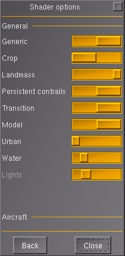
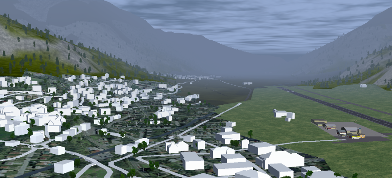
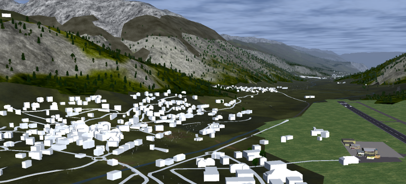
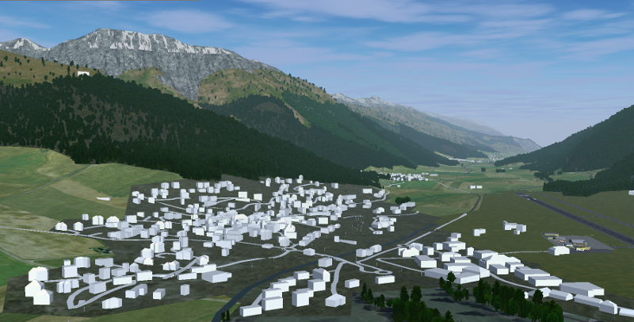

.. _chapter-using-label:

#######################
Using Generated Scenery
#######################

=========================
Adding to FG_SCENERY Path
=========================

You need to add the directory containing the ``Objects`` folder (i.e. not the ``Objects`` folder itself) to the paths, where FlightGear searches for scenery. You can to this either through the command line option ``--fg-scenery`` or setting the FG_SCENERY environment variable. This is extensively described in the ``README.scenery`` and the ``getstart.pdf`` [#]_ documents found in $FG_ROOT/Docs as part of your FlightGear installation.

If you followed the :ref:`directory structure <chapter-creating-directory-structure-label>` presented in chapter :ref:`Preparation <chapter-preparation-label>` and we take the example of ``LSZS`` then you would e.g. use the following command line option:

::

    --fg-scenery=/home/pingu/fg_customscenery/LSZS

.. _chapter-copy-textures-label:

=====================================
Copy Textures, Effects and Other Data
=====================================

If you are using ``buildings.py`` to generate buildings or ``roads.py`` to generate roads, then you need to have the content of the ``tex`` linked from ``osm2city-data`` copied or linked into all scenery sub-folders, where there are ``*.stg`` files. There are two possibilities:

#. Do it manually. In this case you can choose whether to create links or hard copies. If you want to distribute the generated scenery objects, then you must copy the whole directory. E.g. ``/home/pingu/fg_customscenery/LSZS/Objects/e000n40/e009n46/tex`` in the example used previously.
#. Use ``copy_data_stuff.py`` to do it automatically. E.g.

::

    /usr/bin/python3 /home/pingu/development/osm2city/copy_data_stuff.py -f LSZS/params.ini -t Buildings

The mandatory ``-t`` argument is used to write the data to a specific Terrasync folder.

There is also a third possibility of copying the ``tex`` directory into ``$FG_ROOT``. However you would not be able to distribute the generated scenery objects and it might interfere with other scenery objects using a potentially different texture map.

.. _chapter-lod-label:

=======================================
Adjusting Visibility of Scenery Objects
=======================================

The ``osm2city`` related programs and especially ``buildings.py`` are using heuristics and parameters to determine at what level of detail (LOD) scenery objects should be visible. This is done by adding the objects to one of the three FlightGear LOD schemes: "rough" and "detailed".

In ``buildings.py`` you can influence into which of the three LOD ranges the objects are placed by using the following :ref:`Parameters <chapter-parameters-lod-label>`:

* LOD_ALWAYS_DETAIL_BELOW_AREA
* LOD_ALWAYS_ROUGH_ABOVE_AREA
* LOD_ALWAYS_ROUGH_ABOVE_LEVELS
* LOD_ALWAYS_DETAIL_BELOW_LEVELS
* LOD_PERCENTAGE_DETAIL

In FlightGear you can influence the actual distance (in meters) for the respective ranges by one of the following ways:

#. In The FlightGear user interface use menu ``View`` > menu item ``Adjust LOD Ranges`` and then change the values manually.
#. Include command line options into your fgfsrc_ file or `Properties in FGRun`_ like follows (adjust the values to your needs and depending on your hardware capabilities):

::

    --prop:double:/sim/rendering/static-lod/detailed=5000
    --prop:double:/sim/rendering/static-lod/rough=10000
    --prop:/sim/rendering/max-paged-lod=400

.. _fgfsrc: http://wiki.flightgear.org/Fgfsrc
.. _`Properties in FGRun`: http://wiki.flightgear.org/FlightGear_Launch_Control#Properties

=========================================
Disable Urban Shader and Random Buildings
=========================================

There is no point in having both OSM building scenery objects and dynamically generated buildings in FlightGear. Therefore it is recommended to turn off the random building and urban shader features in FlightGear. Please be aware that this will also affect those areas in FlightGear, where there are no generated scenery objects from OSM.

There are two possibilities to disable random buildings:

#. Use command line option ``--disable-random-buildings`` in your fgfsrc_ file — and while you are at it you might want to consider ``--disable-random-objects``.
#. Use the FlightGear menu ``View``, menu item ``Rendering Options``. Tick off ``Random buildings`` and ``Random objects``.

.. image:: fgfs_rendering_options.png

In the same dialog press the ``Shader Options`` button and set the slider for ``Urban`` to the far left in order to disable the urban shader.

.. _chapter-hide-urban-textures-label:

=======================================
Change Materials to Hide Urban Textures
=======================================

FlightGear allows to change the texture used for a given land-class. More information is available in ``$FG_ROOT/Docs/README.materials`` as well as in the FlightGear Forum thread regarding `New Regional Textures <http://forum.flightgear.org/viewtopic.php?f=5&t=26031>`_. There is not yet a good base texture replacing the urban textures. However many users find it more visually appealing to use a uniform texture like grass under the generated buildings etc. instead of urban textures (because urban textures interfere visually with ways, houses etc.). A drawback of using different textures is the absence of trees — however in many regions of the world there are lot of trees / vegetation in urban areas.

E.g. for the airport ``LSZS`` in Engadin in Switzerland you would have to go to ``$FG_ROOT/Materials/regions`` and edit file ``europe.xml`` in a text editor: add name-tags for e.g. ``BuiltUpCover``, ``Urban``, ``Town``, ``SubUrban`` to a material as shown below and comment out the existing name-tags using ``<!-- -->``. Basically all name-tags, which relate to a material using ``<effect>Effects/urban</effect>``. The outcome before and after edit (you need to restart FlightGear in between!) can be seen in the screenshots below (for illustration purposes the buildings and roads do not have textures).

::

  ...
  <material>
    <effect>Effects/cropgrass</effect>
    <tree-effect>Effects/tree-european-mixed</tree-effect>
    <name>CropGrassCover</name>
    <name>CropGrass</name>
    <name>BuiltUpCover</name>
    <name>Urban</name>
    <name>Town</name>
    <name>SubUrban</name>    
    <texture>Terrain/cropgrass-hires-autumn.png</texture>
    <object-mask>Terrain/cropgrass-hires.mask.png</object-mask>
  ...
  
  ...
  <material>
    <!-- <name>Town</name> -->
    <!-- <name>SubUrban</name> -->
    <effect>Effects/urban</effect>
    <texture-set>
  ...

Depending on your region and your shader settings you might want to search for e.g. ``GrassCover`` in file ``global-summer.xml`` instead (shown in screenshot below with ALS_ and more random vegetation). However be aware that you still need to comment out in e.g. ``europe.xml`` and within ``global-summer.xml``.

.. _ALS: http://wiki.flightgear.org/Atmospheric_light_scattering

===============================================
Consider Sharing Your Generated Scenery Objects
===============================================

Although this guide hopefully helps, not everybody might be able to generate scenery objects wih ``osm2city`` related programs. Therefore please consider sharing your generated scenery objects. You can do so by announcing it in the Sceneries_ part of the FlightGear Forums and linking from the bottom of the ``osm2city`` related Wiki_ article.

.. _Sceneries: http://forum.flightgear.org/viewforum.php?f=5
.. _Wiki: http://wiki.flightgear.org/Osm2city.py

.. [#] As of November 2016: chapters 3.1 and 4.2.2
